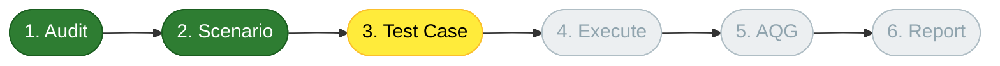
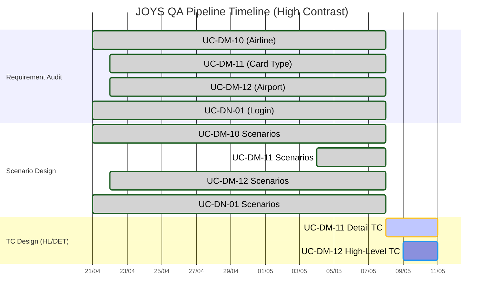
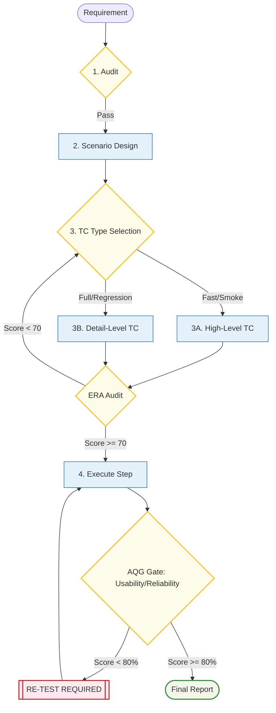

# 📊 PROJECT MASTER DASHBOARD: JOYS QA AUTOMATION

> [!IMPORTANT]
> **Project Health:** 🟢 **Healthy** | **Overall Progress:** [███░░░░░░░] 30%
> **Current Focus:** Step 3A/3B - Test Case Design for DM modules.
> **Quality Gate:** ERA Score ≥ 70 | AQG Score ≥ 80%

## 🔌 Integration Status
| Service | Status | Connection Type | Purpose |
| :--- | :--- | :--- | :--- |
| **Jira (ALM)** | 🔴 Disconnected | API Token | Auto-log Bug & Tracking |
| **Database** | 🔴 Disconnected | JDBC/SQL | Layer 2 Data Verification |
| **MCP (Local)** | 🟢 Connected | Direct Access | DOM & Clipboard Evidence |

---

## 🏗️ Overall Project Pipeline

---

## 📋 Master Task & Traceability Matrix
| UC-ID | Feature Name | Status | Audit | Scenario | Test Case (Type) | RTM Coverage | Latest |
| :--- | :--- | :--- | :---: | :---: | :---: | :---: | :--- |
| **UC-DM-11** | Card Type | 🔵 Design | ✅ v4 | ✅ v2 | 🔄 DET | ✅ Covered | Audit v4 |
| **UC-DM-12** | Airport | ⏳ Pending | ✅ v3 | ✅ v1 | ⏳ HL | ✅ Covered | Audit v3 |
| **UC-DN-01** | Login (2FA) | ⏳ Pending | ✅ v2 | ✅ v2 | ⏳ HL | ✅ Covered | Audit v2 |
| **UC-DM-10** | Airline Cat. | ⏳ Pending | ✅ v7 | ✅ v4 | ⏳ DET | ✅ Covered | Audit v7 |
| **UC-BL-18** | (TBD) | 🔄 Analysis | 🔄 v1 | ⏳ | - | ❌ Gap | v1 |

**Legend:** 🟢 Done | 🔵 Active | 🔄 In Progress | ⏳ Pending | ✅ Covered | ❌ Gap

---

## 📈 Timeline Progress (Gantt Chart)

---

## ⚠️ Risk & Notes
1. **AQG Threshold:** Kết quả thực thi phải đạt trên 80% điểm tin cậy (AQG Score) để Pass.
2. **ERA Audit:** Test Cases phải đạt ERA Score ≥ 70 trước khi thực thi.
3. **Traceability:** File RTM chi tiết (từng AC) nằm trong folder `testcases/[UC-ID]/`.

---

## 📚 Appendix: QA Methodology Flow

