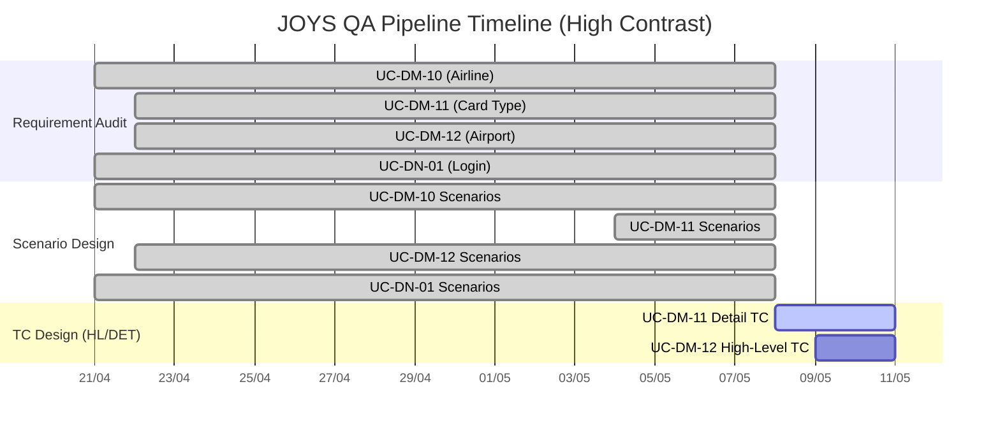
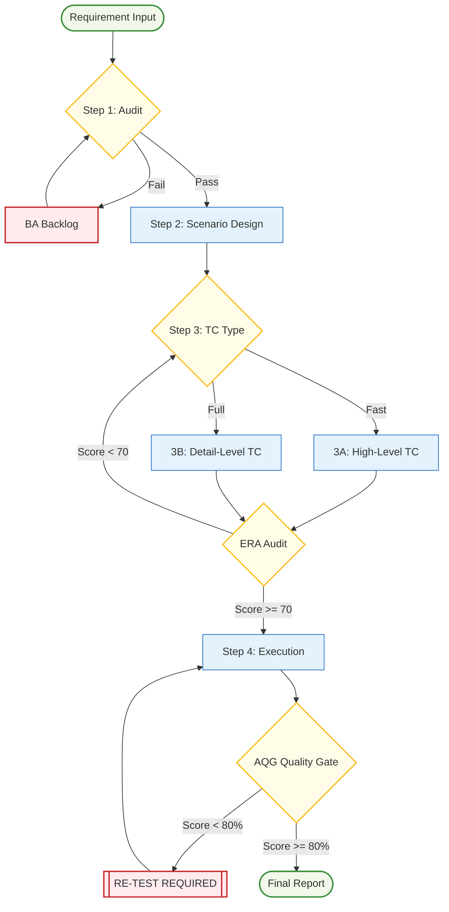

# 📊 PROJECT MASTER DASHBOARD: JOYS QA AUTOMATION

> [!IMPORTANT]
> **Project Health:** 🟢 **Healthy**
> **Current Focus:** Step 3A/3B - Test Case Design for DM modules.
> **Quality Standard:** ERA Score ≥ 70 | AQG Score ≥ 80%

## 🏁 High-Level Summary
- **Overall Progress:** [███░░░░░░░] 30%
- **Total Use Cases:** 8
- **Requirement Audited:** 4/8
- **Scenarios Designed:** 4/8
- **Test Cases Designed:** 0/8
- **Execution Completed:** 0/8

---

## 📈 Timeline Progress (Gantt Chart)

---

## 🗺️ QA Pipeline Flow (Refined)

---

## 📝 Detailed Task Tracker
| UC-ID | Feature Name | Req Audit | Scenario | TC Type | TC Status | Execution | Latest Version |
| :--- | :--- | :--- | :--- | :--- | :--- | :--- | :--- |
| **UC-DM-10** | Airline Cat. | ✅ v7 | ✅ v4 | DET | ⏳ Pending | - | v7 / v4 |
| **UC-DM-11** | Card Type | ✅ v4 | ✅ v2 | DET | 🔄 In Progress | - | v4 / v2 |
| **UC-DM-12** | Airport | ✅ v3 | ✅ v1 | HL | ⏳ Pending | - | v3 / v1 |
| **UC-DN-01** | Login (2FA) | ✅ v2 | ✅ v2 | HL | ⏳ Pending | - | v2 / v2 |
| **UC-BL-18** | (TBD) | 🔄 In Analysis | ⏳ Pending | - | ⏳ Pending | - | v1 |

---

## ⚠️ Risk & Notes
1. **AQG Threshold:** Lưu ý mọi kết quả thực thi phải được AI giải trình (Internal Note) và đạt trên 80% điểm tin cậy (không có False Positive, đủ evidence).
2. **HL vs DET:** Ưu tiên gen High-Level (HL) cho các module DN (Login) để test nhanh Sanity, và Detail (DET) cho các module DM (Danh mục) để phủ kín RBAC.
