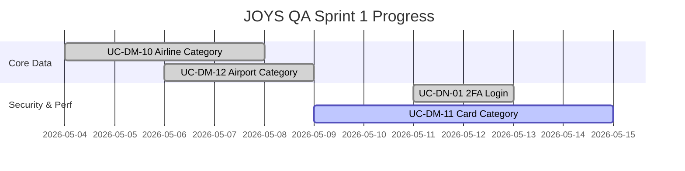

# 📊 PROJECT MASTER DASHBOARD: JOYS QA AUTOMATION
**Dự án:** JOYS-V3 LAMS (Lounge Access Management System)
**Ngày cập nhật:** 2026-05-13
**Phiên bản:** v9

> [!IMPORTANT]
> **Project Health:** 🟢 **Healthy** | **Overall Progress:** [██░░░░░░░░] 22%
> **Current Focus:** Performance Scripting for UC-DM-11 & AQG Audit.
> **Quality Gate:** ERA Score ≥ 70 | AQG Score ≥ 80%

## 🔌 Integration Status
| Service | Status | Connection Type | Purpose |
| :--- | :--- | :--- | :--- |
| **Jira (ALM)** | 🔴 Disconnected | API Token | Auto-log Bug & Tracking |
| **Database** | 🟢 Connected | JDBC/Postgres | host=172.16.200.84 (Layer 2 Verified) |
| **MCP (Local)** | 🟢 Connected | Direct Access | Browser Recording & Evidence |

---

## 🏗️ Overall Project Pipeline

---

## 🏃 Sprint Information (Sprint 1)
- **Name:** Sprint 1 - Foundation & Master Data
- **Timeline:** 2026-05-04 to 2026-05-17
- **Current Status:** 🔄 **In Progress**
- **Tasks in Scope:**
    - [x] **UC-DM-10:** Quản lý danh mục hãng bay (Done)
    - [x] **UC-DM-12:** Quản lý danh mục sân bay (Done)
    - [x] **UC-DN-01:** Login 2FA (Done Functional & Performance)
    - [ ] **UC-DM-11:** Quản lý loại thẻ (Performance Scripting)

---

## 📅 Project Timeline (Gantt)

---

## 📋 Master Task & Traceability Matrix
| UC-ID | Feature Name | Status | Audit | Scenario | Test Case | Functional Exec | Performance |
| :--- | :--- | :--- | :---: | :---: | :---: | :---: | :---: |
| **UC-DM-10** | Quản lý danh mục hãng bay | ✅ Completed | ✅ v7 | ✅ v4 | ✅ HL/DET | ✅ Executed | ⏳ Pending |
| **UC-DM-11** | Quản lý loại thẻ | 🔄 In Progress | ✅ v4 | ✅ v2 | ⏳ Pending | ⏳ Pending | 🔄 Scripting |
| **UC-DM-12** | Quản lý danh mục sân bay | ✅ Completed | ✅ v3 | ✅ v1 | ✅ HL/DET | ✅ Executed | ⏳ Pending |
| **UC-DN-01** | Login 2FA | ✅ Completed | ✅ v2 | ✅ v2 | ✅ HL/DET | ✅ Executed (UI+DB) | ✅ Executed (v1) |
| **UC-BL-18** | UC-BL-18 | ⏳ Pending | ⏳ Pending | ⏳ Pending | ⏳ Pending | ⏳ Pending | ⏳ Pending |

---

## 📈 Execution & Reliability Metrics
| Module | Reliability (AQG) | Defect Density | Stability | Notes |
| :--- | :--- | :--- | :--- | :--- |
| **UC-DN-01** | 98% (HIGH) | 0% | 🟢 Stable | UI+DB Verified. Perf PASS (4 users). |
| **UC-DM-12** | 85% (TRUSTED) | 0% | 🟢 Stable | 6 cases skipped due to Env. |
| **UC-DM-10** | 78% (TRUSTED) | 12.5% | 🟡 At Risk | 1 FAIL (FUNC_05) due to data constraint. |

---

## 📅 Recent Activities & Log
- **2026-05-13:** Thực thi thành công **UC-DN-01 (Login 2FA)**: Functional (UI+DB) và Performance (4 users).
- **2026-05-13:** Tích hợp thành công **Layer 2 Data Verification** (Postgres JDBC) vào kịch bản test.
- **2026-05-13:** Cập nhật **Lesson Learned (v3.1)** về tính toàn vẹn của báo cáo Excel.
- **2026-05-11:** Thực thi thành công UC-DM-10 (Airline Category).

---
**Antigravity QA Management** - *Real-time Project Oversight*
