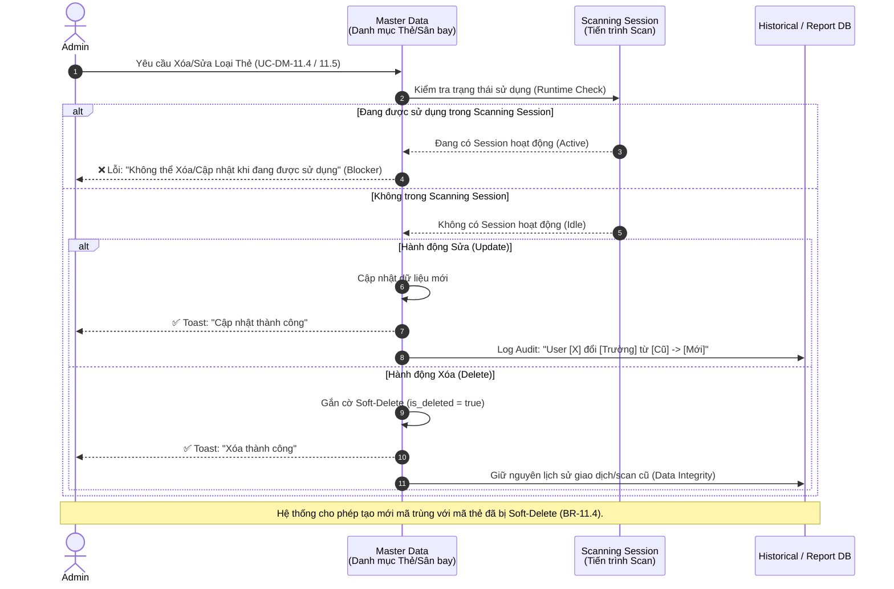

# End-to-End Integration Flow & Dependency Graph
**Dự án:** JOYS-V3 LAMS (Lounge Access Management System)
**Mục đích:** Xác định bức tranh tổng thể về sự phụ thuộc giữa các Use Case (UC) và quy tắc toàn vẹn dữ liệu (Data Integrity) trong toàn hệ thống trước khi tiến hành viết kịch bản kiểm thử (Test Case Design).

---

## 1. System Dependency Graph (Biểu đồ phụ thuộc)

Biểu đồ này thể hiện luồng điều kiện tiên quyết (Pre-conditions) để một người dùng có thể truy cập và thao tác với dữ liệu lõi của hệ thống.

```mermaid
graph TD
    %% Khối Authentication
    subgraph Auth_Module [1. Phân hệ Xác thực & Bảo mật (Authentication)]
        A1[UC-DN-01: Đăng nhập LDAP/LAMS] --> A2{Trạng thái 2FA?}
        A2 -- Chưa kích hoạt --> A3[UC-2FA-04: Kích hoạt 2FA qua QR]
        A2 -- Đã kích hoạt --> A4[UC-2FA-05: Nhập mã OTP]
        A3 --> A5((Truy cập Hệ thống))
        A4 --> A5
        A6[UC-MK-02: Đặt lại mật khẩu] -.-> A1
    end

    %% Khối User/System Management
    subgraph User_System_Module [2. Phân hệ Quản lý Tài khoản & Hệ thống]
        A5 --> U1[UC-2HS-08: Quản lý hồ sơ cá nhân]
        U1 --> U2[UC-MK-03: Đổi mật khẩu qua Profile]
        U1 --> U3[UC-2FA-06: Thiết lập lại 2FA cá nhân]
        A5 --> U4[UC-2FA-07: Reset 2FA bởi Admin]
        U4 -. Yêu cầu kích hoạt lại .-> A3
        
        A5 --> U5[UC-ND-14: Quản lý người dùng]
        U5 -->|Phân quyền - RBAC| Auth_Module
        A5 --> U6[UC-VB-15: Quản lý văn bản]
    end

    %% Khối Master Data & Lõi nghiệp vụ
    subgraph Core_Data [3. Phân hệ Dữ liệu Lõi (Master Data & Runtime)]
        A5 --> D1[UC-DM-11: Danh mục Loại thẻ]
        A5 --> D2[UC-DM-12: Danh mục Sân bay]
        A5 --> D3[UC-DM-13: Danh mục Phòng chờ]
        A5 --> D4[UC-DM-16: Danh mục Nhóm phòng chờ]
        
        D3 -->|Thuộc về| D2
        D3 -->|Thuộc về| D4
        
        D1 -->|Tham chiếu Master Data| R1[Cấu hình Điều kiện Phòng chờ]
        D2 -->|Tham chiếu Master Data| R1
        D3 -->|Tham chiếu Master Data| R1
        
        A5 --> D5[UC-WL-17: Quản lý Whitelist]
        A5 --> D6[UC-BL-18: Quản lý Blacklist]
        
        D5 -->|Tham chiếu| R1
        D6 -->|Tham chiếu| R1
        
        R1 -->|Cung cấp Rule| R2[Scanning Session / Runtime Scan]
        D1 -->|Data Mapping| R2
        D2 -->|Data Mapping| R2
        D3 -->|Data Mapping| R2
    end

    %% Quy tắc Ràng buộc Toàn vẹn (Integrity Rules)
    R2 -. "Block Edit/Delete nếu đang Scan" .-> D1
    R2 -. "Block Edit/Delete nếu đang Scan" .-> D2
    R2 -. "Block Edit/Delete nếu đang Scan" .-> D3
    R1 -. "Soft Delete, giữ nguyên Cấu hình cũ" .-> D1
    
    style Auth_Module fill:#f9f2f4,stroke:#d0021b,stroke-width:2px
    style User_System_Module fill:#f2f9f6,stroke:#008744,stroke-width:2px
    style Core_Data fill:#f4f7f9,stroke:#0057e7,stroke-width:2px
```

---

## 2. E2E Master Data Integrity Flow (Luồng toàn vẹn dữ liệu)

Biểu đồ tuần tự dưới đây làm rõ **Common Rule về Data Integrity (Soft Delete & Runtime Lock)** - quy tắc tối quan trọng cho mọi module danh mục (Loại thẻ, Sân bay). Hệ thống ngăn chặn việc thay đổi dữ liệu cấu hình khi đang có tiến trình Scan (Runtime) để tránh sai lệch báo cáo/truy vết.



---

## 3. Các Common Rules Đặc Biệt QA Cần Lưu Ý Khi Viết Testcase

Để đảm bảo tính nhất quán trên toàn bộ các Use Case, QA cần đưa các Assertions sau vào mọi kịch bản thao tác dữ liệu:

1. **Session & Security Check (API Level):** Mọi API thao tác Dữ liệu Lõi (Thêm, Sửa, Xóa) phải xác thực trạng thái tài khoản. Nếu trong phiên làm việc, quyền của User bị thu hồi hoặc tài khoản bị khóa, API phải trả về lỗi `401/403` và Logout user thay vì xử lý dữ liệu.
2. **Soft Delete Integrity:** Bất kỳ thao tác "Xóa" nào ở Danh mục chỉ được phép làm ẩn dữ liệu trên UI Danh mục và chặn việc chọn dữ liệu đó ở các form tạo mới (Dropdown). Dữ liệu này **tuyệt đối không được biến mất** ở các báo cáo, lịch sử scan đã xảy ra trước đó.
3. **Audit Trail Verbatim:** Các thao tác cấu hình phải tạo Log ghi rõ `Tiêu đề`, `Người thực hiện`, `Thời gian` và `Chi tiết thay đổi (Giá trị cũ -> Giá trị mới)`.
4. **Data Isolation (RBAC):** UI hiển thị các nút chức năng (Thêm/Sửa/Xóa) tuân thủ nghiêm ngặt theo Ma trận phân quyền. Tấn công trực tiếp qua API Endpoint khi không có quyền phải bị chặn ở Backend (HTTP 403 Forbidden).
